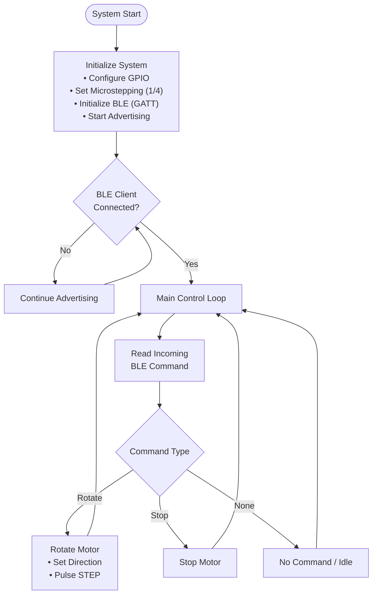

```mermaid
flowchart TD
    %% =======================
    %% Initialization
    %% =======================
    Start([System Start])

    Setup["Initialize System<br/>• Configure GPIO<br/>• Set Microstepping (1/4)<br/>• Initialize BLE (GATT)<br/>• Start Advertising"]

    %% =======================
    %% Connection Handling
    %% =======================
    ConnCheck{"BLE Client<br/>Connected?"}
    Advertise["Continue Advertising"]

    %% =======================
    %% Main Loop
    %% =======================
    MainLoop["Main Control Loop"]

    ReadCmd["Read Incoming<br/>BLE Command"]

    CmdType{"Command Type"}

    %% =======================
    %% Actions
    %% =======================
    Rotate["Rotate Motor<br/>• Set Direction<br/>• Pulse STEP"]
    Stop["Stop Motor"]
    Idle["No Command / Idle"]

    %% Flow
    Start --> Setup --> ConnCheck

    ConnCheck -- No --> Advertise --> ConnCheck
    ConnCheck -- Yes --> MainLoop

    MainLoop --> ReadCmd --> CmdType

    CmdType -- "Rotate" --> Rotate --> MainLoop
    CmdType -- "Stop" --> Stop --> MainLoop
    CmdType -- "None" --> Idle --> MainLoop
```
