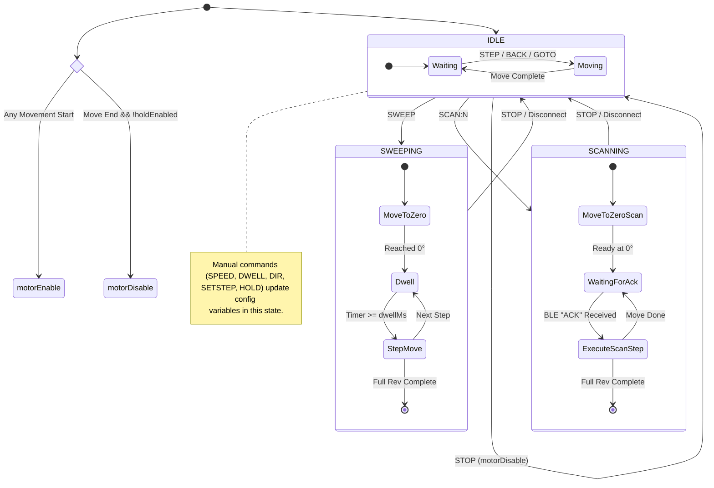

```mermaid
stateDiagram-v2
    [*] --> IDLE
    
    state IDLE {
        direction LR
        [*] --> Waiting
        Waiting --> Moving : STEP / BACK / GOTO
        Moving --> Waiting : Move Complete
    }

    note right of IDLE
        Manual commands (SPEED, DWELL, DIR, 
        SETSTEP, HOLD) update config 
        variables in this state.
    end note

    %% Transitions from IDLE
    IDLE --> SWEEPING : SWEEP
    IDLE --> SCANNING : SCAN:N
    IDLE --> IDLE : RESET / ZERO / STATUS / INFO

    state SWEEPING {
        [*] --> MoveToZero
        MoveToZero --> Dwell : Reached 0°
        Dwell --> StepMove : Timer >= dwellMs
        StepMove --> Dwell : Next Step
        StepMove --> [*] : Full Rev Complete
    }

    state SCANNING {
        [*] --> MoveToZeroScan
        MoveToZeroScan --> WaitingForAck : Ready at 0°
        WaitingForAck --> ExecuteScanStep : BLE "ACK" Received
        ExecuteScanStep --> WaitingForAck : Move Done
        ExecuteScanStep --> [*] : Full Rev Complete
    }

    %% Global Interrupts
    SWEEPING --> IDLE : STOP / Disconnect
    SCANNING --> IDLE : STOP / Disconnect
    IDLE --> IDLE : STOP (motorDisable)

    %% Motor State handling
    state MotorLogic <<choice>>
    [*] --> MotorLogic
    MotorLogic --> motorEnable : Any Movement Start
    MotorLogic --> motorDisable : Move End && !holdEnabled
```
